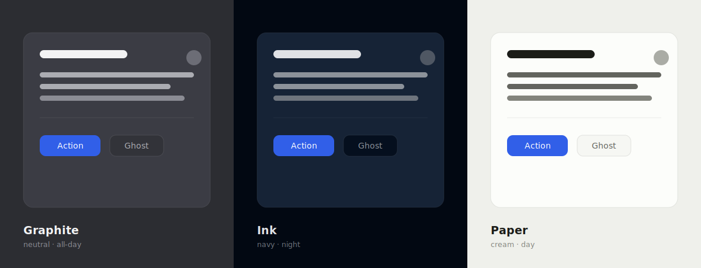

<div align="center">
  

  <p><strong>A modern React component library built on Base UI and Tailwind CSS,<br />with a 3-tier semantic theme system.</strong></p>

  [](https://www.npmjs.com/package/@waveso/ui)
  [](./LICENSE)
  
  

  <br />

  <!-- TODO: replace assets/showcase-placeholder.svg with a real screenshot of the Showcase story across the three themes -->
  

  <br /><br />

  Full documentation coming soon at **[ui.wave.so](https://ui.wave.so)**

</div>

---

## Why Wave UI

A production-ready design-token architecture that's modern, semantic, and highly maintainable.

Most UI libraries carry two structural problems:

1. **Redundant token names** (`border-border`, `ring-ring`) — which read backwards the moment background and text swap roles: a background becomes `bg-foreground`, text becomes `text-background`.
2. **Material-style paired tokens** (`card` + `card-foreground`, `popover` + `popover-foreground`) — flexible per layer, but they add complexity, kill the emphasis ladder, and lose free composability. `foreground-muted` is meant as "text _on_ muted," yet most people read it as "muted text." The result is ~14 tokens, half of them redundant.

Both models work, and end users never notice. But for the people _building_ on the system, the shape matters.

Wave builds around an intuitive, intentional **3-tier hierarchy** — for almost everything:

- 3 themes — Paper, Graphite, Ink palettes
- 3 background colors for surfaces
- 3 content colors for text
- 3 identity colors for brand
- 3 border colors for structural luminance
- 3 duration tiers for transitions
- 3 blur values
- 3 scale sizes
- 3 stagger times
- 3 shadows with adaptable color
- 3 offset amounts for transforms
- …and more

It also builds around 3 semantic intents:

- **Background** colors focus on elevation — how deep a surface sits
- **Content** colors focus on emphasis — how strongly something reads
- **Border** colors focus on structure — how functional a boundary is

This is the right shape for a system centered on an emphasis ladder: clean and minimal, but flexible.

### Themes

The three themes are a homage to the **pre-digital writing desk** — the _surface_, the _pen_, the _pencil_ — and each maps to its color: cream ***Paper***, blue-black ***Ink***, gray ***Graphite***.

**Graphite** is the default **neutral pencil-gray** theme, built on a low-saturation dark-neutral family with a subtle blue bias. That bias keeps the light steps from going flat — a tiny cool cast instead of pure gray.

**Paper** and **Ink** are an elegant classic pair, each with a purpose: Paper is tuned for daytime and bright spaces; Ink for night and dark spaces. In every theme the _structure_ (text and borders) stays a cool-biased neutral, while the _surface_ carries the identity.

## Taxonomy

Wave pays close attention to token taxonomy. Surfaces encode elevation; borders act as _light interference rather than geometry_.

### Background

- `--foundation` — the deepest layer, the base where elevation starts
- `--surface` — the middle layer: cards, sidebars, content boxes
- `--elevated` — the highest layer: floating windows, modals, dropdowns, dialogs

### Foreground

- `--contrast` — titles, primary text
- `--muted` — body text, icons, any mark
- `--soft` — placeholders, hints

### Borders

- `--line` — subtle separators
- `--edge` — component boundary
- `--solid` — structural definition

### Ring

- `--focus` — active / focus states

### Brand

- `--primary` — wired to the Wave ramp
- `--secondary` — neutral fill
- `--accent` — alternative emphasis

### Border strategy

This is the sophisticated move most libraries skip.

Wave biases heavily toward **transparent (alpha) borders as the default**, with a **solid token reserved for functional states**.

Wave's palette behaves like a layered _material system_, not a flat UI. Dark surfaces, a soft text hierarchy, and subtle elevation shifts (low-contrast steps) mean borders should not introduce a new "color layer" — that would break the illusion of depth — yet structure still needs a solid option.

Alpha borders **inherit the surface beneath them**, take the **content color as their luminance source**, keep hue consistent across surfaces, and scale naturally.

Solid borders compete with the surface ladder and create visual "grid noise" if overused, so use them sparingly. Overusing them flattens everything into "outlined boxes" with reduced perceived elevation — the "Bootstrap feel."

The default **alpha** borders are ideal for:

- Cards
- Panels
- Inputs
- Subtle separators

The **solid** borders are ideal for:

- Layout definition (sidebar vs. content)
- Component grouping
- Focus containment
- "Frame-like" boundaries

**Rule of thumb:**

- If it separates **surface from surface** → alpha border
- If it separates **layout regions** → solid border
- If it indicates **interaction / state** → colored alpha border

---

## Installation

```bash
npm install @waveso/ui @base-ui/react class-variance-authority clsx tailwind-merge
```

## Setup

Import Tailwind, then the Wave UI preset, in your CSS entry point:

```css
@import "tailwindcss";
@import "@waveso/ui/styles.css";
```

The preset provides every CSS variable (colors, radii, motion, shadows) with light and dark support. Override any variable in your own `:root` / `.dark` blocks to customize the theme.

## Usage

Every component is its own entry point, so you ship only what you import:

```tsx
import { Button } from '@waveso/ui/button';
import { Card, CardHeader, CardTitle, CardContent } from '@waveso/ui/card';

export function Example() {
  return (
    <Card>
      <CardHeader>
        <CardTitle>Get started</CardTitle>
      </CardHeader>
      <CardContent>
        <Button>Click me</Button>
      </CardContent>
    </Card>
  );
}
```

Every component is built on a [Base UI](https://base-ui.com) primitive — full keyboard and ARIA support — and styled entirely through the theme tokens above, so overriding a token propagates everywhere.

## Components

A comprehensive set spanning **actions, forms, layout, navigation, overlays, feedback, data display, and motion effects** — all built on Base UI primitives and driven by the theme tokens.

Browse every component, with live variants and source, in **Storybook** (`npm run storybook`). A full documentation site is on the way at **[ui.wave.so](https://ui.wave.so)**.

## Requirements

| Dependency | Version |
|---|---|
| React | ^19.0.0 |
| React DOM | ^19.0.0 |
| Base UI | ^1.6.0 |
| Tailwind CSS | v4 |
| CVA | ^0.7.0 |
| clsx | ^2.0.0 |
| tailwind-merge | ^3.0.0 |

Some components have optional peer dependencies — install only what you use:

- **Form** — `react-hook-form`
- **Input OTP** — `input-otp`
- **Animations** — `motion`

## Development

```bash
npm install
npm run storybook    # Start Storybook
npm run build        # Build the library
npm run typecheck    # Type-check
npm run dev          # Watch mode
```

### Project structure

```
.changeset/          # Changesets config
.storybook/          # Storybook config + theme CSS
assets/              # README / brand assets
src/
  *.tsx              # Component source files
  *.stories.tsx      # Storybook stories
  styles.css         # Theme preset (CSS variables + Tailwind mapping)
  hooks/             # Custom hooks
  lib/               # Utilities (cn, internal icons)
```

## Releasing

This project uses [Changesets](https://github.com/changesets/changesets) with GitHub Actions.

1. Run `npx changeset` to describe your changes (patch, minor, or major)
2. Commit the generated changeset file with your PR
3. When merged to `main`, CI automatically versions and publishes to npm

<details>
<summary>Manual release (without CI)</summary>

If you're not using the GitHub Actions workflow, you can publish manually. Changesets skips versions already published to npm, so this won't conflict if CI has already run.

```bash
npx changeset              # Create a changeset
npx changeset version      # Apply version bump
npm run release            # Build and publish to npm
```

</details>

## License

[MIT](./LICENSE)
